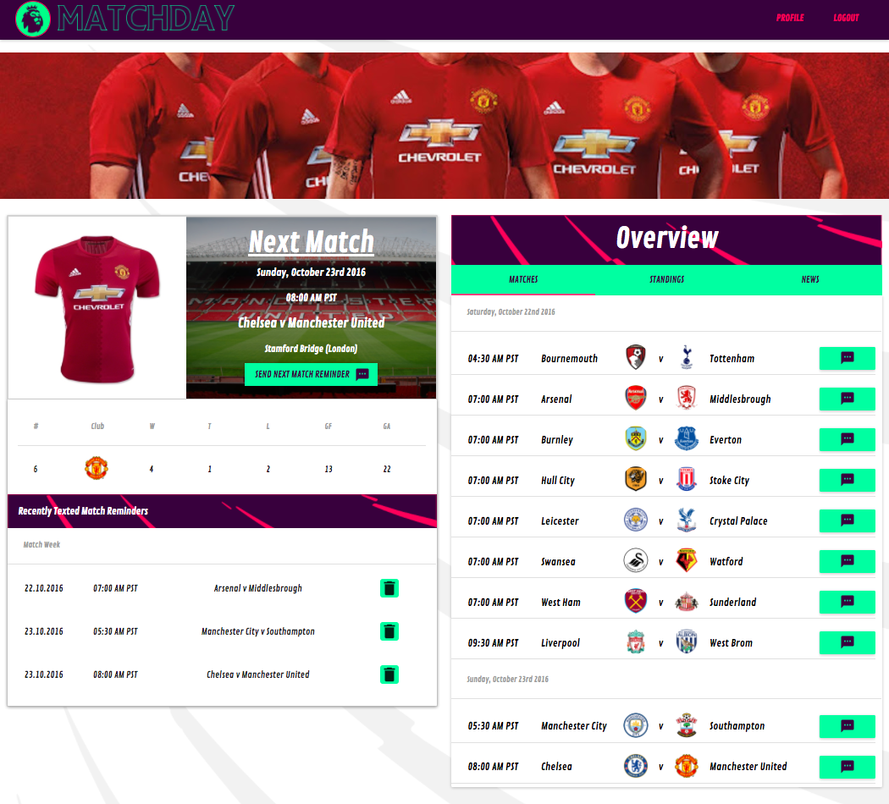

#Matchday: https://mattstuhring-matchday.herokuapp.com/

### User is not logged in:

### Logged in users example profile page:

##What problem does Matchday solve?
A web app that helps you keep track of your favorite English Premier League soccer club.

##How does your project solve this problem?
It allows users to send text game reminders that includes the time, date, and clubs playing threw Twilio SMS API.

##What web APIs did it use?
Twilio API, Bing Search API, and Football-Api.

##What technologies did it use?
The site uses a Node.js Express server, React, Material UI, Knex.js, PostgreSQL, Javascript, HTML/CSS, Twilio API, Bing Search API, and Football-Api.
